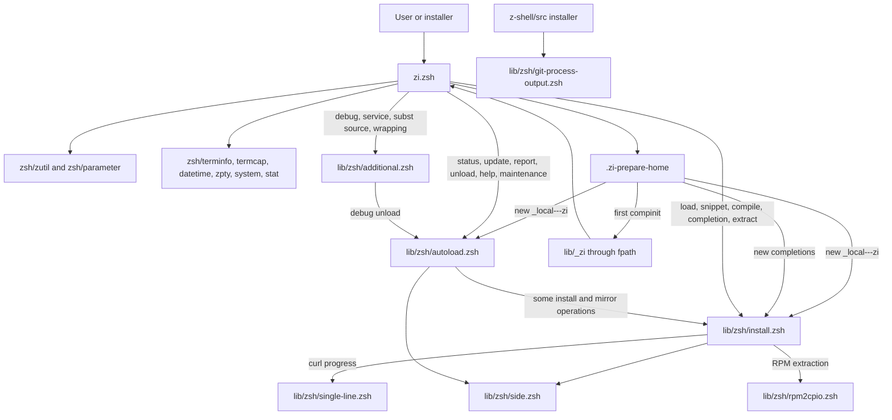
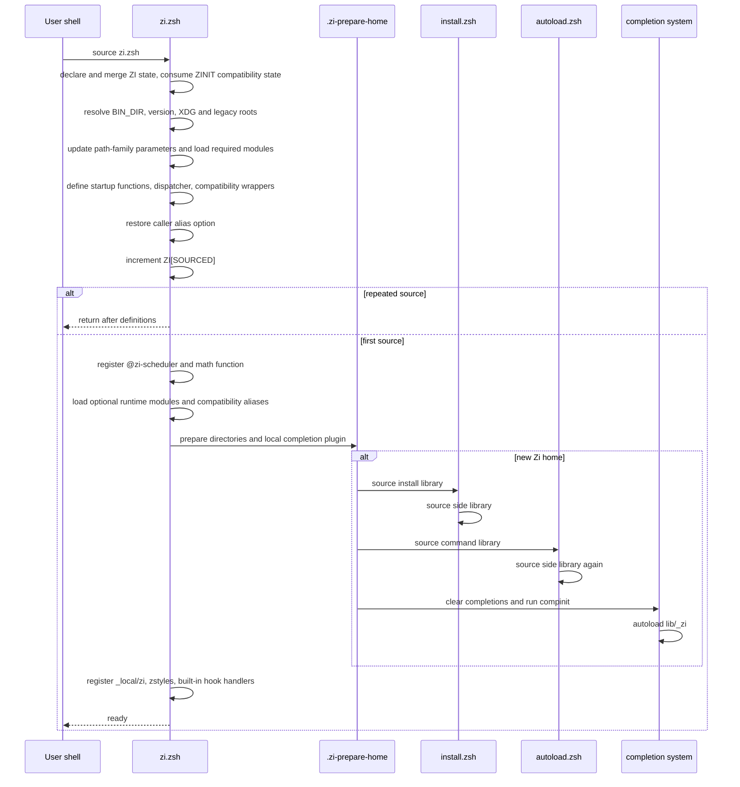

# Zi core architecture audit

## Executive conclusion

Recommendation: reorganize only, while retaining Zi's existing coarse-grained
hybrid loading model.

`zi.zsh` is both the stable public entry point and the startup-critical
implementation container. It already keeps most maintenance, installation,
update, completion, archive, and debug operations on cold paths by sourcing
three libraries on demand. A function-per-file autoload conversion or a broad
module split would cross dynamic-scope, source-order, function-table, global
state, installer, self-update, and compiled-file contracts without a measured
startup need.

The safe next step is not a file move. It is a focused Wave 1:

1. Fix `.zi-load-object` so its direct status matches the nested load status,
   with the sole caller owning aggregation.
2. Remove the stale duplicate `.zi-at-eval` definition from
   `lib/zsh/autoload.zsh`; its only callers and the maintained implementation
   are in `lib/zsh/install.zsh`.
3. Correct the stale `.zi-update-in-parallel` declaration comment.
4. Keep the unrelated initialization, repeated-load, snippet-ID, and archive
   helper findings separate until their owning issue and characterization
   boundary are approved.

This document is at the design checkpoint. Baseline investigation is complete;
the source changes above are proposed, not yet implemented.

## Scope and limitations

### Audited revision and environment

| Item             | Observed value                                      |
| ---------------- | --------------------------------------------------- |
| Repository       | `z-shell/zi`                                        |
| Revision         | `d01d99feac8870415c60ee0a2a03f792f3c899bd`          |
| Checkout         | Detached manual worktree from current `origin/next` |
| Worktree state   | Clean before investigation                          |
| Local Zsh        | 5.9.2, x86_64 Linux                                 |
| Git history      | Complete, not shallow                               |
| CI platform      | `ubuntu-latest` only for native Zsh jobs            |
| CI Zsh selection | Distribution `zsh` package, not version-pinned      |

The current official Zsh release listing was checked during the audit. The
local 5.9.2 build matches the current released version listed there:
<https://zsh.sourceforge.io/releases.html>.

The source contains compatibility branches for Zsh 5.1, 5.3, 5.4, and 5.8.1,
but the repository does not declare or test a version matrix. Those branches
are evidence of intended compatibility, not proof of a supported floor.

Only Linux was executed locally. macOS, Cygwin, musl, FreeBSD, DragonFly BSD,
RPM, DMG, and other tool-specific branches were inspected statically. They
remain unverified in this audit.

No live plugin download, real update, self-update against a remote, deletion
against a user home, or external tracker mutation was performed. Existing
tests use local repositories and fixtures for update and download behavior.

### Sources of evidence

The conclusions combine:

- native parsing and compilation;
- all top-level repository tests;
- isolated first-use and warm-start measurements;
- controlled runtime probes with temporary homes;
- `$functions_source`, option-state, hook, and module observations;
- direct call-site and string-dispatch searches;
- the public contract manifest;
- Git blame, pickaxe searches, and relevant commit diffs;
- current read-only GitHub issue, pull request, and Project 28 state;
- current Zi, organization, Zsh Plugin Standard, and official Zsh guidance.

Runtime non-execution was never treated as sufficient proof of dead code.

## Baseline validation

### Repository layout and authoritative inputs

The authoritative core source is tracked directly:

- `zi.zsh`
- `lib/zsh/additional.zsh`
- `lib/zsh/autoload.zsh`
- `lib/zsh/install.zsh`
- `lib/zsh/side.zsh`
- `lib/zsh/git-process-output.zsh`
- `lib/zsh/rpm2cpio.zsh`
- `lib/zsh/single-line.zsh`
- `lib/_zi`
- `lib/zcompile`

No tracked `.zwc` file exists. `.gitignore` ignores `*.zwc`. CI parses and
compiles Zsh inputs, while promotion readiness removes its generated compiled
files. Zi's self-reload compiles a hard-coded set at
`lib/zsh/autoload.zsh:720-734`, so any future split must update that list and
its tests.

`docs/man/zi.1` appears generated from older documentation, but no owning
generator is present in this repository. It was treated as a tracked artifact
with uncertain local authority and was not edited. `contracts/public-contract-v1.json`
is the authoritative checked public-surface inventory for impact analysis.

No runtime dependency or lock file was added or changed.

### Native checks

The audit ran `zsh -n` and isolated `zcompile` over 41 Zsh inputs discovered by
the same file classes used by CI.

| Check            | Result                                                 |
| ---------------- | ------------------------------------------------------ |
| Files parsed     | 41                                                     |
| Syntax failures  | 0                                                      |
| Compile failures | 0                                                      |
| Existing warning | `lib/zsh/rpm2cpio.zsh:54: redirection with no command` |

Compiled outputs were placed outside the source tree and removed after the
check.

### Existing tests

All 13 top-level tests passed before edits:

1. `tests/archive-extraction.zsh`
2. `tests/completion-refresh.zsh`
3. `tests/hook-ownership.zsh`
4. `tests/message-formatting.zsh`
5. `tests/parallel-update.zsh`
6. `tests/path-resolution.zsh`
7. `tests/plugin-standard-callbacks.zsh`
8. `tests/public-contract-impact.zsh`
9. `tests/release-tag-verification.zsh`
10. `tests/scheduler-idle.zsh`
11. `tests/self-update-reload.zsh`
12. `tests/snippet-directory-mirror.zsh`
13. `tests/version-reporting.zsh`

Some tests emit existing `warn_create_global` diagnostics for Zsh's special
matching parameters, especially `match`, `mbegin`, and `mend`. They were
recorded as baseline diagnostics, not failures.

### Performance baseline

Measurements used `env -u FPATH zsh -df`, isolated `HOME` and XDG roots, and
`zsh/datetime`. Clearing inherited `FPATH` matters because the parent process
exports a user-specific value even when Zsh starts with `-f`.

| Scenario                        | Samples |     Median |        p95 |       Mean |
| ------------------------------- | ------: | ---------: | ---------: | ---------: |
| Warm source of `zi.zsh`         |      30 |  16.836 ms |  17.098 ms |  16.889 ms |
| First source into a new Zi home |      10 | 504.709 ms | 507.530 ms | 506.082 ms |
| Warm core plus `autoload.zsh`   |      20 |  23.810 ms |  23.994 ms |  23.864 ms |
| Warm core plus `install.zsh`    |      20 |  22.564 ms |  23.614 ms |  22.725 ms |
| Warm core plus both libraries   |      20 |  29.529 ms |  29.842 ms |  29.558 ms |

The library comparison includes the core source time. Relative to the warm
core median, `autoload.zsh` adds about 7.0 ms, `install.zsh` about 5.7 ms, and
both about 12.7 ms. These numbers support retaining coarse lazy loading.

The approximately 0.5 second first-use cost is mostly home preparation and
completion initialization, not ordinary steady-state source cost.

## Current architecture

### Core source and load dependency graph



`autoload.zsh` is not a Zsh autoload directory. It is a lazily sourced command
and maintenance library. Its name is historically misleading, but renaming it
would touch self-update, tests, external installations, compiled files, and
possibly user code. The current filename should remain stable.

Both `autoload.zsh` and `install.zsh` source `side.zsh` unconditionally at line 7. Loading the two libraries in either order therefore redefines the eight
shared side functions. No stateful source-time work occurs in `side.zsh`, so
no functional regression was observed, but last-definition-wins behavior is a
real load-order property.

### Exact initialization sequence



Verified source-time side effects include:

- creating Zi data, cache, config, log, prefix, module, plugin, snippet,
  completion, service, and manual directories as needed;
- changing `path`, `fpath`, `manpath`, `mailpath`, `cdpath`, and `logpath`
  conditionally;
- enabling `auto_cd` when the configured CDPATH directory already exists;
- loading required and optional Zsh modules;
- defining public, compatibility, and internal functions;
- defining deprecated aliases `zini`, `zinit`, and `zplugin` by default;
- registering one `@zi-scheduler` `precmd` entry when `zsh/datetime` is
  available;
- installing completion symlinks and running completion initialization on a
  fresh home;
- registering built-in update and clone hook handlers in `ZI_EXTS2`.

In controlled alias-on and alias-off shells, sourcing preserved the caller's
option state. Re-sourcing incremented `ZI[SOURCED]` from 1 to 2 and retained
exactly one scheduler hook. The definitions before the guard are re-evaluated;
source-executed registration after the guard is not.

### Runtime workflow sequences

```mermaid
flowchart TD
    Dispatch[zi dispatcher] --> Parse[parse mode, options, and ICE]
    Parse --> Kind{workflow}

    Kind -->|plugin light or load| LoadPlugin[.zi-load or .zi-load-plugin]
    LoadPlugin --> EnsureInstall[load install.zsh if installation is needed]
    LoadPlugin --> Shadow[temporarily shadow autoload, compdef, bindkey, zstyle, alias, zle]
    Shadow --> SourcePlugin[source plugin files with ZERO and dynamic ICE]
    SourcePlugin --> Diff[capture functions, parameters, options, paths, hooks, widgets]
    Diff --> Restore[restore temporary function table entries]

    Kind -->|snippet| LoadSnippet[.zi-load-snippet]
    LoadSnippet --> ResolveSnippet[resolve or download through install.zsh]
    ResolveSnippet --> SourceSnippet[source selected file or files]

    Kind -->|wait, load, unload, service| Turbo[.zi-submit-turbo]
    Turbo --> Tasks[ZI_TASKS and ZI_RUN]
    Tasks --> Scheduler[@zi-scheduler precmd, chpwd, sched, and ZLE fd]
    Scheduler --> RunTask[.zi-run-task]

    Kind -->|status, update, report, unload, help| ColdCommands[source autoload.zsh]
    ColdCommands --> Dynamic[direct cases or .zi-$1 string dispatch]

    Kind -->|completion or compile| ColdInstall[source install.zsh]
    ColdInstall --> CompletionOps[compinit, link mutations, zcompile]

    Kind -->|self-update| SelfUpdate[fetch and fast-forward under zsystem flock]
    SelfUpdate --> CompileList[compile hard-coded core list]
    CompileList --> SourceList[source hard-coded reload list]
```

The existing tests characterize these paths without unsafe external work:

- plugin and snippet load plus Plugin Standard callbacks;
- scheduler idle, activation, drain, and reactivation;
- completion install, disable, enable, and uninstall;
- compile and archive behavior;
- parallel local updates;
- self-update no-op, local fast-forward, locking, compile failure, and source
  failure;
- hook ownership, unload, and repeated load behavior;
- XDG, legacy, symlink, and explicit path resolution.

### Runtime definition evidence

There are 191 top-level function definitions across the main core and its
primary libraries, representing 190 names because `.zi-at-eval` is defined
twice.

| File                             | Top-level definitions | Normal warm source | First fresh source           |
| -------------------------------- | --------------------: | ------------------ | ---------------------------- |
| `zi.zsh`                         |                    71 | Loaded             | Loaded                       |
| `lib/zsh/additional.zsh`         |                     7 | Cold               | Cold                         |
| `lib/zsh/autoload.zsh`           |                    68 | Cold               | Loaded                       |
| `lib/zsh/install.zsh`            |                    34 | Cold               | Loaded                       |
| `lib/zsh/side.zsh`               |                     8 | Cold               | Loaded twice through parents |
| `lib/zsh/git-process-output.zsh` |                     3 | Standalone         | Standalone                   |

On a warm source, `$functions_source` attributed 71 functions to `zi.zsh` and
no functions to the cold libraries. On a new home it attributed 68 functions
to `autoload.zsh`, 33 surviving definitions to `install.zsh`, eight to
`side.zsh`, and `_zi` to `lib/_zi`. The install count is one lower than its
static count because the later `autoload.zsh` source shadows `.zi-at-eval`.

## File responsibility matrix

| File                             | Actual responsibilities                                                                                                                                      | Path                       | Coupling                                                           | Filename accuracy                              | Recommended action                                         |
| -------------------------------- | ------------------------------------------------------------------------------------------------------------------------------------------------------------ | -------------------------- | ------------------------------------------------------------------ | ---------------------------------------------- | ---------------------------------------------------------- |
| `zi.zsh`                         | Bootstrap, paths, public dispatcher, load engine, ICE parsing, temporary function substitution, diff capture, reporting primitives, scheduler, compatibility | Startup                    | Very high through `ZI`, `ICE`, function table, hooks, caller scope | Partial: stable entry point and implementation | Keep consolidated; make only focused internal fixes        |
| `lib/zsh/side.zsh`               | Object lookup, ID formatting, path computation, ICE merge and persistence, countdown                                                                         | Cold shared                | High; sourced by both large libraries                              | Vague but small and cohesive enough            | Keep path stable; document double sourcing                 |
| `lib/zsh/install.zsh`            | Clone and download, snippets, completion install, compile, archive extraction, package assets, install/update hook handlers                                  | Cold                       | Very high through `ZI`, `ICE`, `OPTS`, temp files, external tools  | Broad but materially installation-oriented     | Keep; remove only proven leaks or duplicates               |
| `lib/zsh/autoload.zsh`           | Diff computation, reports, unload, update/status, self-update, completions, command implementations, help, module management                                 | Cold                       | Very high through dispatcher and shared globals                    | Misleading                                     | Do not rename; describe as command and maintenance library |
| `lib/zsh/additional.zsh`         | Source substitution, services, function wrapping, debug lifecycle                                                                                            | Cold                       | High through temporary function replacement and ZPTY/FIFOs         | Misleadingly generic                           | Keep until separately characterized                        |
| `lib/zsh/git-process-output.zsh` | Installer-facing Git progress filter                                                                                                                         | Standalone                 | External contract with `z-shell/src`                               | Accurate enough                                | Preserve public path                                       |
| `lib/zsh/single-line.zsh`        | Normalize curl progress into one terminal line                                                                                                               | Standalone child           | Called by install download functions                               | Accurate                                       | Keep                                                       |
| `lib/zsh/rpm2cpio.zsh`           | Convert RPM input to cpio stream                                                                                                                             | Standalone child           | Called by archive extraction                                       | Accurate                                       | Keep; preserve existing compile warning as known baseline  |
| `lib/_zi`                        | Completion definition                                                                                                                                        | Autoloaded through `fpath` | Coupled to command and ICE token sets                              | Conventional                                   | Keep                                                       |
| `lib/zcompile`                   | Minimal `zcompile` command wrapper                                                                                                                           | Standalone                 | Packaging utility                                                  | Accurate                                       | Keep                                                       |

## Public APIs and compatibility entry points

`contracts/public-contract-v1.json` identifies the checked surfaces:

- command tokens in `ZI[cmd-list]`;
- ICE tokens in `ZI[ice-list]`;
- `@zi-register-annex`;
- `@zi-register-hook`;
- `+zi-message` and `+zi-progress`;
- compatibility functions `❮▼❯`, `zpcdreplay`, `zpcdclear`, `zpcompinit`,
  `zpcompdef`, and `zpextract`;
- conditional Prezto compatibility function `pmodload`;
- deprecated aliases `zini`, `zinit`, and `zplugin`;
- the path `lib/zsh/git-process-output.zsh`.

Additional names are plausibly external even when not in the manifest:

- `zi`, `zi-turbo`, `zicdreplay`, `zicdclear`, `zicompinit`,
  `zicompinit_fast`, and `zicompdef`;
- `@zsh-plugin-run-on-unload` and `@zsh-plugin-run-on-update`, required by the
  Zsh Plugin Standard profile;
- exported `ZPFX`, `PMSPEC`, `XDG_ZI_HOME`, `XDG_ZI_CACHE`, and
  `XDG_ZI_CONFIG`;
- `zsh_loaded_plugins` and user-configurable `ZI[...]` keys;
- annex handler names stored in `ZI_EXTS` and `ZI_EXTS2`.

The leading dot is an internal naming signal, not an access-control boundary.
Any removal still needs call, dynamic dispatch, docs, tests, history, and
external-use review.

## Global state ownership and mutation

```mermaid
flowchart LR
    Bootstrap[zi.zsh bootstrap] --> ZI[ZI associative state]
    Bootstrap --> Public[ZPFX, PMSPEC, XDG_ZI_*, zsh_loaded_plugins]
    Dispatcher[zi dispatcher] --> Pending[ZI_ICES pending ICE]
    Dispatcher --> Active[ICE and ZI_ICE active ICE]
    Active --> Persisted[ZI_SICE persisted object ICE]
    Loader[plugin and snippet loaders] --> Registry[ZI_REGISTERED_PLUGINS and ZI_SNIPPETS]
    Loader --> Tracking[ZI_REPORTS and per-object diff keys]
    Tracking --> Unload[autoload.zsh unload and report logic]
    Extensions[annex and core registration] --> ExtState[ZI_EXTS and ZI_EXTS2]
    Turbo[turbo submission] --> Queue[ZI_TASKS and ZI_RUN]
    Scheduler[@zi-scheduler] --> Queue
    Install[install.zsh] --> Temp[INSTALLED_*, ADD_COMPILED, PID temp files]
    Debug[additional.zsh] --> Service[ZSRV_* and service FIFOs]
```

| State                                                                 | Primary writer                                  | Important readers                    | Notes                                                                                                     |
| --------------------------------------------------------------------- | ----------------------------------------------- | ------------------------------------ | --------------------------------------------------------------------------------------------------------- |
| `ZI`                                                                  | `zi.zsh` bootstrap and all subsystems           | All core files                       | Central configuration, capability, runtime, colors, ownership, and cache namespace; no single later owner |
| `ZI_ICES`                                                             | `zi ice` and dispatcher                         | Dispatcher                           | Pending command-level ICE, cleared when consumed                                                          |
| `ICE`, `ZI_ICE`                                                       | Dispatcher and named-output helpers             | Load, install, update, hooks         | Often caller-local and intentionally visible through dynamic scope                                        |
| `ZI_SICE`                                                             | `.zi-pack-ice`, side helpers, dispatcher        | Reload, update, unload, scheduler    | Serialized per-object ICE state                                                                           |
| `ZI_REGISTERED_PLUGINS`, `ZI_SNIPPETS`                                | Load/register paths                             | Reports, unload, completion, status  | Public activity and object registries                                                                     |
| `ZI_REPORTS` and per-object `ZI[...]` keys                            | Diff and load tracking                          | Report and unload logic              | Function, option, environment, parameter, hook, widget, bindkey, alias, and timing ownership              |
| `ZI_EXTS`, `ZI_EXTS2`                                                 | Annex/core registration                         | Dynamic hook and subcommand dispatch | Store quoted handler names and metadata                                                                   |
| `ZI_TASKS`, `ZI_RUN`                                                  | Turbo submission and scheduler                  | Scheduler and task runner            | Deferred queue plus run counters                                                                          |
| `ZI_COMPDEF_REPLAY`                                                   | Temporary `compdef` replacement and `zicompdef` | Replay/list/clear commands           | Compatibility-visible array                                                                               |
| `ZI_MESSAGE_PALETTE`                                                  | Bootstrap                                       | Message renderer                     | Private complete palette supporting non-TTY rendering                                                     |
| `INSTALLED_EXECS`, `INSTALLED_COMPS`, `SKIPPED_COMPS`, `ADD_COMPILED` | Install/update paths                            | Hook reporting and callers           | Deliberately global result arrays                                                                         |
| `REPLY`, `reply`                                                      | Many helpers                                    | Immediate caller                     | Conventional Zsh output channel; source ends with global `REPLY` declaration                              |
| `ZSRV_*`                                                              | `additional.zsh` service path                   | ZPTY service loop                    | Service process state                                                                                     |

### Dynamic-scope dependencies

Dynamic scope is an active design mechanism, not incidental style:

- `ICE`, `OPTS`, `reply`, `REPLY`, `MATCH`, and many triple-underscore locals
  are read or written by callees.
- side helpers accept output parameter names and assign through parameter
  indirection.
- hook functions consume locals established by load and update frames.
- the dispatcher currently exposes its `___retval` local to
  `.zi-load-object`; CORE-001 removes that unnecessary coupling.
- source-time plugin callbacks depend on `ZERO`, `ZI[CUR_USPL2]`, and the
  active ICE frame.

Moving these functions behind new function boundaries or separate autoload
files can change lookup and lifetime even when the function text is unchanged.

## Hooks, traps, completions, widgets, and asynchronous work

| Mechanism                  | Verified role                                                                                              |
| -------------------------- | ---------------------------------------------------------------------------------------------------------- |
| `add-zsh-hook` arrays      | Zi scheduler plus per-plugin ownership tracking for standard Zsh lifecycle arrays                          |
| `ZI_ZLE_HOOKS_LIST`        | Tracks named ZLE hook widgets separately from ordinary widgets                                             |
| Function-table replacement | Temporarily shadows `autoload`, `compdef`, `source`, `.`, `bindkey`, `zstyle`, `alias`, and `zle`          |
| Annex handlers             | Quoted function names stored in `ZI_EXTS` and `ZI_EXTS2`, invoked by sorted hook keys                      |
| Trigger-load generation    | `eval` creates user-named functions that load an object and optionally forward the call                    |
| ZLE descriptor callback    | `zle -F` and process substitution wake scheduler work                                                      |
| Zsh scheduler              | `sched`, `precmd`, and `chpwd` move deferred tasks between dormant and active states                       |
| ZPTY and FIFOs             | Service processes use `zsh/zpty`, locks, two FIFOs, signals, and control commands                          |
| Update workers             | Parallel update starts background jobs, records PID/output mappings, and installs signal traps             |
| Pager watchdog             | Update output may start a pager and a detached timeout killer                                              |
| Completion                 | `fpath`, `compinit`, `_comps`, symlinks, replayed `compdef`, and optional background zcompdump compilation |
| Archive extraction         | Per-invocation function definitions select list/extract commands, staging, traps, and cleanup              |

Future reachability analysis must search stored handler strings, command cases,
generated functions, function hashes, hook arrays, completion metadata, and
public contracts before classifying a symbol.

## Naming conventions for new internal code

The current conventions are mixed but meaningful:

- `zi` and `zi-*`: user-facing commands and helpers.
- `+zi-*`: message and reporting utilities used as a semi-public API.
- `@zi-*` and `@zsh-plugin-*`: registration or lifecycle callbacks.
- `.zi-*`: internal core functions. Treat as potentially externally called.
- `:zi-*`: temporary replacements for builtins or autoload machinery.
- `∞zi-*`: dynamically registered install and update hook handlers.
- `z*` compatibility names: retained wrappers for older Zi, Zinit, Zplugin,
  or Prezto usage.
- `___name`: dispatcher and scheduler locals, sometimes intentionally visible
  through dynamic scope.
- uppercase arrays such as `ZI_*`: shared global state or public result state.

New code should use an existing prefix that matches its actual dispatch role,
declare ordinary locals, avoid new caller-local mutation, and document any
intentional dynamic-scope input or output. Do not add a new naming layer or
rename a public or compatibility name merely for consistency.

## Findings

### Summary table

| ID       | Location                                                        | Category                                                     | Confidence                                          | Compatibility risk          | Proposed disposition                                                   |
| -------- | --------------------------------------------------------------- | ------------------------------------------------------------ | --------------------------------------------------- | --------------------------- | ---------------------------------------------------------------------- |
| CORE-001 | `zi.zsh:1360-1370`, caller at `2864-2868`                       | Inconsistent error handling; dynamic-scope ownership problem | High                                                | Medium                      | Fix under issue #446 with plugin and snippet status tests              |
| CORE-002 | `lib/zsh/autoload.zsh:302-309`, `lib/zsh/install.zsh:2046-2055` | Duplicate implementation; shadowed definition                | High                                                | Low to medium               | Keep install owner, remove autoload copy under issue #449              |
| CORE-003 | `lib/zsh/install.zsh:1831-1970`                                 | Conditional helper leak                                      | High                                                | Low                         | Propose separate tracked fix and focused unknown-archive test          |
| CORE-004 | `zi.zsh:1294-1357`                                              | Incomplete initialization; state ownership problem           | High                                                | Medium to high              | Preserve in this wave; issue #448 owns transactional repair            |
| CORE-005 | `lib/zsh/autoload.zsh:1097-1205`                                | Abandoned experiment; dynamic-scope ambiguity                | High for dormant branch, medium for deletion safety | Medium                      | Preserve with issue #113 until widget-chain characterization exists    |
| CORE-006 | `lib/zsh/autoload.zsh:1129-1134`                                | Unfinished repeated-load feature                             | High                                                | High                        | Preserve; issue #113 owns behavior                                     |
| CORE-007 | `zi.zsh:2339-2354`                                              | Unfinished or unclear snippet-ID handling                    | Medium                                              | High                        | Add effective-ID collision characterization before change, issue #449  |
| CORE-008 | `lib/zsh/autoload.zsh`                                          | Misleading filename; excessive responsibility                | High                                                | High                        | Document, do not rename or split now                                   |
| CORE-009 | both large libraries at line 7                                  | Implicit load-order dependency; repeated definition          | High                                                | Medium                      | Preserve; optional future guarded source only after source-order tests |
| CORE-010 | `zi.zsh:16` versus canonical wiki standard                      | Documentation mismatch                                       | High                                                | Low in code, medium in docs | Keep code; update wiki separately to reflect commit `5dabe46`          |
| CORE-011 | `zi.zsh:3240-3252`                                              | Required compatibility despite low direct reachability       | High                                                | High                        | Preserve all compatibility wrappers                                    |
| CORE-012 | CI and version checks                                           | Insufficient compatibility evidence                          | High                                                | N/A                         | Add a version/platform matrix only through a separate policy decision  |
| CORE-013 | `zi.zsh:1294-1349`                                              | First-use eager path within lazy architecture                | High                                                | High                        | Preserve; document 0.5 second first-home behavior                      |

### CORE-001: `.zi-load-object` reports the wrong direct status

Verified fact: when `.zi-load` was stubbed to return 7, a wrapper with a local
`___retval=11` observed:

```text
direct=0 accumulator=18
```

The helper mutates the caller-local accumulator at line 1369, then returns the
misspelled and normally unset `__retval` at line 1370. Its sole direct caller
captures the false success in `___last_retval` and also adds the direct status
to the accumulator.

Counter-evidence: ordinary immediate `zi load` still returned 7 in a probe,
because the hidden dynamic mutation reaches the dispatcher's aggregate. The
bug is therefore not that every top-level failure is lost. The bug is that the
helper contract and any control decision using its direct status are false.

History: the typo and dynamic mutation predate the 2021 Zi rename and are
visible in commit `37483c7c07d7bc630308cd4c23fdcb4d89b6634f`. The lines were
carried through `393034fa` and renamed in `ac53658e`.

Tracker: <https://github.com/z-shell/zi/issues/446> is open, Project 28 Todo,
and has matching acceptance criteria.

Proposed action: make `.zi-load-object` return the nested plugin or snippet
status without changing a caller local. Keep the sole caller's existing
aggregation. Add success and failure tests for plugin and snippet dispatch and
assert aggregation occurs exactly once.

### CORE-002: `.zi-at-eval` has two owners

Verified facts:

- The only call sites are `lib/zsh/install.zsh:2410` and `2430`.
- The maintained definition is beside them at `2047-2055`.
- `lib/zsh/autoload.zsh:303-309` has no internal caller.
- Source order decides which body wins.
- A fresh home sources install first and autoload second, leaving the autoload
  copy active.
- Both observed implementations preserve the tested `%atclone` status, but
  their bodies are not identical.

History: both copies were present by the large rename commit `ac53658e`. Commit
`843cdd386f7820cd16ce5e7ee9c9a002500f9853` simplified and corrected the install
copy in 2022 but left the autoload copy unchanged.

Counter-evidence: the leading dot does not prevent external use, and current
fresh-start behavior makes the autoload copy observable through
`$functions_source`. Removal therefore needs load-order and hook regression
tests, even though no supported call path needs that copy.

Tracker: <https://github.com/z-shell/zi/issues/449> is open and Project 28 In
Progress. Its option-spelling subtask merged in PR #455; duplicate-helper work
remains explicit next work.

Proposed action: remove the autoload copy and keep install as the single owner.
Do not add a wrapper or new shared file. Loading install already defines the
helper before either caller exists.

### CORE-003: unknown archives leak `→zi-check`

Verified fact: an isolated call to `ziextract --nobkp sample.unknown unknown`
returned 0 and left this state:

```text
check_defined=1 list_defined=0 extract_defined=0 wrapper_defined=0
```

`ziextract` defines `→zi-check` before selecting a format. Recognized and error
paths remove the arrow helpers, but the unrecognized-format branch only removes
the wrapper and safety helpers.

Counter-evidence: the leaked name is deliberately unusual and an internal
subroutine. No direct caller outside `ziextract` was found. Its compatibility
risk is low, but the finding is not covered by issue #446 or the explicit
acceptance criteria in #449.

Proposed action: create or extend an owning tracker item before source edits,
then add one assertion to `tests/archive-extraction.zsh` and remove the helper
on the unrecognized path. Do not refactor the extraction dispatcher.

### CORE-004: home preparation can accept an incomplete layout

Verified fact: with `snippets/` present and `services/` absent, source returned
0, set `ZI[HOME_READY]=1`, and left the service directory absent. The source
creates services only inside the branch that creates snippets. It also marks
the home ready before directory operations can fail.

Tracker: <https://github.com/z-shell/zi/issues/448> is open and Project 28 Todo
with transactional and retry acceptance criteria.

Disposition: preserve in this wave. Correct repair requires defining the full
home invariant and testing partial layouts, failures, and retry. It should not
be hidden inside an architecture cleanup.

### CORE-005 and CORE-006: dormant widget scaffolding and repeated loads

Inside `.zi-unload`, `skip_delete` is local to an anonymous child function.
The only statement that would populate it is commented out, as is the alternate
function-rewrite method. After that child returns, the deletion loop tests a
different dynamically resolved `skip_delete`, normally unset, and can only
reach `Would delete` if an outer caller supplies such a parameter.

The block arrived already disabled in the imported 2021 history and remains
adjacent to `TODO: #113 Fully handle multiple plugin loads`.

Static and history evidence strongly identify abandoned scaffolding, but the
surrounding widget-chain behavior is high risk and issue #113 is active. Do not
delete or revive it in Wave 1. Characterize repeated widget ownership first.

### CORE-007: snippet ICE path TODO is not proven defective

`.zi-load-ices` first forms a plugin path from an effective ID, then falls back
to `.zi-get-object-path snippet` if that directory is absent. The TODO was
introduced in commit `f3379e804c1f2983d72d88b81563cdc29dcf9ebe` as a generalized
refactor note, not a finished specification.

An effective-ID collision between a plugin directory and snippet metadata may
select the plugin path first. This is a strong risk, not a confirmed defect.
Issue #449 correctly requires a collision test before changing the API.

### CORE-008 and CORE-009: file boundaries are coarse but intentional

The large files have broad responsibilities, yet the measured boundary is
useful: normal startup loads only `zi.zsh`, while maintenance and installation
remain cold. Splitting either file would make more source-order edges explicit
without reducing shared `ZI` and `ICE` coupling.

The shared `side.zsh` source is redundant after the first large library loads,
but guarding it changes last-definition-wins behavior and self-reload source
order. Preserve it until repeated-source and revision-reload tests explicitly
cover that change.

### CORE-010: `PMSPEC` documentation is stale, not the source

Current `zi.zsh` exports `PMSPEC=0fuUpiPs`. Commit
`5dabe4633667c45615776c0022c83f19fa92bf8b` intentionally removed the unallocated
`X` capability. The canonical wiki page still says Zi's active source uses
`0fuUpiPsX`, while also stating that `X` has no definition or consumer.

The source and callback tests are internally consistent. The durable fix is a
separate wiki correction, not restoring an undefined letter in Zi.

### CORE-011: compatibility names with no internal caller are not dead

`zpcdreplay`, `zpcdclear`, `zpcompinit`, `zpcompdef`, and `zpextract` have no
internal call sites. They were restored recently by commits `847b7c5d` and
`eaa3a8d5`, appear in the public contract, and are explicit external wrappers.
`zicompdef` is similarly described as having an undefined use case but is a
documented plugin-load utility. Preserve them.

## Architecture alternatives and scorecard

Scores use 5 as best. For risk and cost criteria, 5 means lowest risk or cost.

| Criterion                         | A: current structure plus cleanup | B: responsibility modules | C: function autoload | D: new bootstrap hybrid |
| --------------------------------- | --------------------------------: | ------------------------: | -------------------: | ----------------------: |
| Behavioral regression risk        |                                 5 |                         2 |                    1 |                       2 |
| Warm startup performance          |                                 5 |                         3 |                    4 |                       4 |
| First-call latency                |                                 4 |                         3 |                    2 |                       2 |
| Source/autoload overhead          |                                 5 |                         3 |                    2 |                       3 |
| `.zwc` compatibility              |                                 5 |                         3 |                    2 |                       3 |
| Dynamic-scope safety              |                                 5 |                         2 |                    1 |                       2 |
| Load-order simplicity             |                                 4 |                         2 |                    1 |                       2 |
| Global-state coupling             |                                 2 |                         3 |                    2 |                       3 |
| Maintainability                   |                                 3 |                         4 |                    3 |                       4 |
| Testability today                 |                                 4 |                         2 |                    1 |                       2 |
| Contributor discoverability       |                                 3 |                         4 |                    2 |                       4 |
| Installer/updater compatibility   |                                 5 |                         2 |                    1 |                       2 |
| Packaging complexity              |                                 5 |                         3 |                    1 |                       2 |
| Version compatibility confidence  |                                 4 |                         2 |                    1 |                       2 |
| Platform compatibility confidence |                                 4 |                         2 |                    1 |                       2 |
| Migration cost                    |                                 5 |                         2 |                    1 |                       1 |
| Incremental delivery              |                                 5 |                         4 |                    2 |                       3 |
| **Total**                         |                            **73** |                    **46** |               **29** |                  **45** |

### Option A: keep structure and clean internally

This is the recommended option. It preserves the measured 16.8 ms warm path,
existing compiled-file and self-update behavior, and the current stable public
entry point. The known defects do not require a structural extraction.

### Option B: responsibility-oriented modules

This could eventually improve discoverability around update, completion, and
archive concerns. Today those areas share too much mutable state and too many
source-order assumptions. Extracting them would first require named state
contracts and characterization that the repository does not yet have.

### Option C: function-level autoloading

This has the worst current fit. Zi already implements and shadows Zsh autoload
for plugin behavior, and its internal functions depend on dynamically scoped
state. A function-per-file layout would also multiply packaging, `fpath`,
`.zwc`, first-call, and self-update surfaces for a single-digit millisecond
cold-library saving.

### Option D: a new small-bootstrap hybrid

Zi already has a coarse hybrid: startup core plus lazily sourced libraries.
Making the bootstrap materially smaller could be useful only after a profile
shows which of the 71 warm functions dominate startup and after state ownership
is explicit. Current timing does not justify that migration.

## Proposed conservative change waves

### Wave 1: approved issue work

Pending explicit implementation approval:

1. Issue #446:
   - add `tests/load-object-status.zsh`;
   - make `.zi-load-object` return the nested status without mutating
     `___retval`;
   - keep aggregation once in the sole dispatcher caller.
2. Issue #449:
   - characterize `.zi-at-eval` under both library source orders;
   - remove `lib/zsh/autoload.zsh`'s stale copy;
   - keep the install implementation and its existing callers;
   - correct the parallel updater's declaration comment.

No file move, new dependency, public rename, compatibility wrapper, or new
autoload directory is proposed.

### Wave 2: separately tracked defects

- Issue #448: make home preparation complete, failure-propagating, and
  retryable.
- Issue #113: finish repeated plugin-load ownership semantics, including ZLE
  widget chains.
- Issue #449: add the plugin/snippet effective-ID collision test, then resolve
  or narrow the snippet ICE TODO.
- CORE-003: track and fix the unknown-archive temporary function leak.

### Wave 3: evidence before extraction

Only consider a structural extraction if all are true:

- a profile attributes meaningful startup cost to a cohesive group;
- that group has explicit inputs, outputs, and state ownership;
- no caller-local or source-local dependency remains implicit;
- first-use and warm performance budgets are stated;
- source order, repeat source, compiled source, and self-update reload tests
  cover the boundary;
- installer and public-contract consumers are updated together.

## Changes implemented

At this checkpoint, only this maintainer audit document has been added. No core
source, test, contract, generated artifact, workflow, or dependency has been
changed.

## Changes deliberately not implemented

- No broad split or new internal module tree.
- No function-level autoload conversion.
- No rename of `autoload.zsh`, `side.zsh`, or `additional.zsh`.
- No removal based only on low reference counts.
- No compatibility wrapper or alias removal.
- No change to `PMSPEC`; current source reflects intentional commit #394.
- No uncommenting of dormant autoload or widget experiments.
- No opportunistic repair of issue #448 or #113.
- No live updater, installer, release, or network workflow.
- No GitHub issue, project, pull request, branch, commit, or push mutation.

## Validation plan after approved edits

After each coherent Wave 1 group:

1. Run the new focused status/source-order tests.
2. Run `zsh -n` on changed Zsh files and tests.
3. Compile changed sources to an isolated temporary output.
4. Run the directly related existing suites:
   - plugin and snippet callbacks;
   - scheduler idle and deferred behavior;
   - archive extraction if CORE-003 is later approved;
   - self-update reload for source-list and repeated-source safety.
5. Run all 13 top-level tests.
6. Run public-contract impact checks.
7. Re-check repeated source, alias option preservation, hook count, function
   availability, and relevant global state.
8. Repeat warm and first-home performance measurements with the same harness.
9. Run `git diff --check`, inspect the final diff, and verify no `.zwc` or
   temporary artifact remains.

The expected performance result for the proposed Wave 1 is no measurable warm
startup regression. Any statistically clear regression will stop the change
for investigation.

## Remaining risks

- The supported Zsh floor is not stated or tested by a version matrix.
- Only Ubuntu CI executes native Zsh; dormant platform branches remain static
  evidence only.
- The central `ZI` associative array has many writers and no mechanically
  enforced ownership schema.
- Dynamic scope remains essential in loader, hook, and output-parameter paths.
- First-home initialization is much slower than warm source and is not
  separately performance-gated.
- Source reload cannot delete functions removed by an update; the code warns
  that a new shell is required.
- `autoload.zsh` and `install.zsh` each redefine `side.zsh` functions.
- The self-update compile/source lists must be updated manually for new files.
- The manpage's generation source is not present locally.
- PMSPEC documentation in the wiki is stale relative to the intentional Zi
  change.

## Maintainer routing guide

Use these defaults for new work:

- Bootstrap, path resolution, ICE parsing, immediate load behavior, scheduler,
  or public command dispatch: start in `zi.zsh`.
- Clone, download, completion installation, compile, package, archive, or
  install/update hook implementation: start in `lib/zsh/install.zsh`.
- Report, unload, update/status, self-update, command help, completion
  maintenance, or module command: start in `lib/zsh/autoload.zsh`.
- Object path, ID normalization, or ICE merge/persistence shared by install and
  maintenance: start in `lib/zsh/side.zsh`.
- Service, debug, source substitution, or function wrapping: start in
  `lib/zsh/additional.zsh`.
- Public surface changes: update and run the public-contract tooling before
  implementation is considered complete.

Before moving a function, test its source order, option state, dynamic inputs,
`$functions_source`, repeated source behavior, `.zwc` path, self-update list,
hooks, external string dispatch, and public-contract status.
